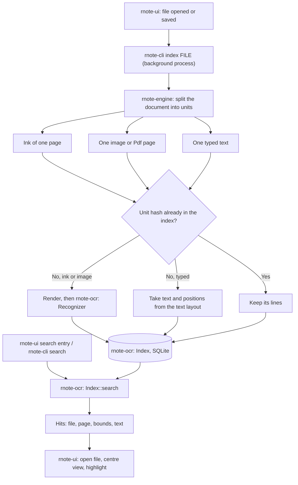

# rnote-ocr

Text recognition for rnote documents and the index that makes the recognised text searchable.
Everything runs on the CPU and on the device.

## Overview



The crate has two parts:

| Module | Feature | Used by | What it does |
|---|---|---|---|
| `index` | always built | `rnote-cli`, `rnote-ui` | SQLite index: store lines per unit, search |
| `recognize` | `recognize` | `rnote-cli` only | Find text lines in an image and read them |

`rnote-ui` depends on this crate without the `recognize` feature. The models and the model runtime are therefore only
part of `rnote-cli`. Recognition runs in that separate process, so its memory never sits in the app and is given back
when the process exits.

## Units

A document is not recognised as a whole. `Engine::extract_text_units` (in `rnote-engine`) splits it into units that are
read on their own:

- **Ink**: the brush and shape strokes of one page.
- **Image**: one bitmap or vector image, for example an imported Pdf page. Images are separate from ink, so handwriting
  on top of a Pdf page and the print below it do not disturb each other.
- **Typed**: one text typed with the typewriter. Its characters and their positions come from the text layout, no
  recognition is involved.

Every unit has a hash of its content. A unit whose hash is already in the index is neither rendered nor recognised
again. Editing one page of a long document therefore costs one page, not the document.

## Recognition

`Recognizer::recognize(image)` returns the text lines of an image, each with its characters:

1. **Detection** (`pp-ocrv5_mobile_det.onnx`): the image is scaled so its long side is at most 960 px and the model
   marks the pixels that belong to text. Connected regions become line boxes.
2. **Recognition** (`pp-ocrv5_mobile_rec.onnx`): each line box is cut from the full-resolution image, scaled to a
   height of 48 px and read. The model emits one frame per horizontal step; a character is the first frame of a run.
3. **Candidates**: for each character the up to five most likely readings are kept with their confidence
   (`CharBox::candidates`), together with the horizontal extent of the character (`x0`, `x1`).

Keeping candidates matters for handwriting and for text without context, where the most likely reading is often
wrong while the right one is among the next few.

The models are PP-OCRv5 mobile (Apache-2.0), one model for Traditional and Simplified Chinese, English and more, print
and handwriting. They are compiled into the binary, see [models](models/README.md). They are run with ONNX Runtime
through the `ort` crate, which downloads a prebuilt runtime at build time.

## Index

One SQLite file, `index.sqlite`, in `$XDG_DATA_HOME/rnote/ocr/` (usually `~/.local/share/rnote/ocr/`).

```
files (id, path, mtime, size)            one row per indexed file
units (id, file_id, hash, page, source)  one row per unit of a file
lines (id, unit_id, x, y, w, h, text, chars)
```

- `chars` is the JSON of the line's `CharBox`es, `text` its most likely reading.
- All positions are in document coordinates, so a hit can be shown on the canvas directly.
- A file whose `mtime` and `size` match is skipped without being loaded.
- Units are written as they are finished. A file's `mtime` and `size` are only set once all of its units are in, so an
  interrupted run continues where it stopped.
- Files that no longer exist are removed on the next `rnote-cli index` run.

## Search

`Index::search(query)` goes through all lines. A line matches where the characters of the query appear in a row, each
among the candidates of its position. Whitespace and letter case are ignored. A hit covers exactly the matched
characters. Hits on the most likely readings rank first, then by confidence.

## Limits

- Text on an arc or at a steep angle is not found, line boxes are axis-aligned.
- Zhuyin (bopomofo) is not in the model's dictionary and is read as look-alike characters.
- Search does not cross line breaks.
- A moved or renamed file is read again in full.

## Trying it

```bash
# Lines, character boxes and candidates of one image
cargo run -p rnote-ocr --features recognize --example recognize -- image.png

# The unit images of a document, as recognition gets to see them
cargo run -p rnote-engine --example text_units -- file.rnote out-dir/

cargo run -p rnote-cli -- index notes-folder/
cargo run -p rnote-cli -- search 注音
```
